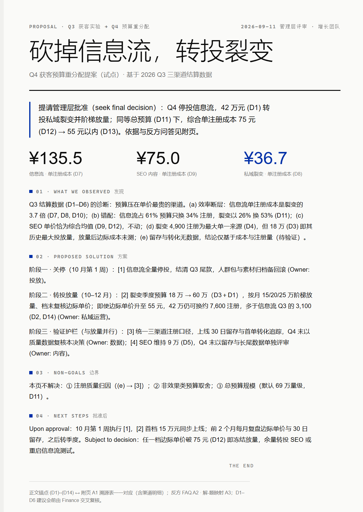
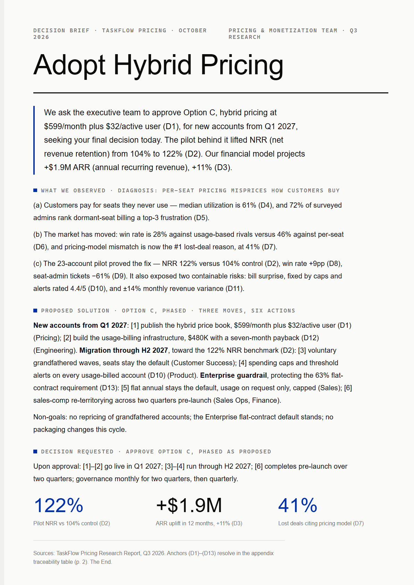
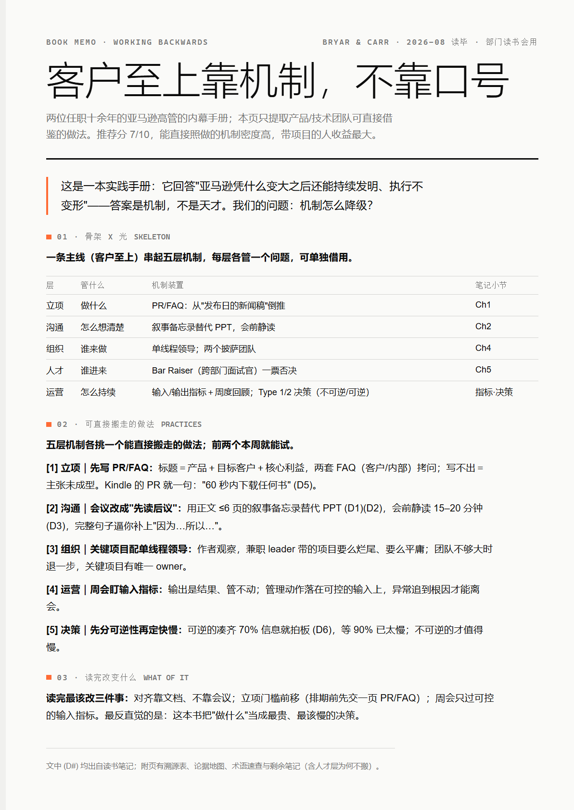
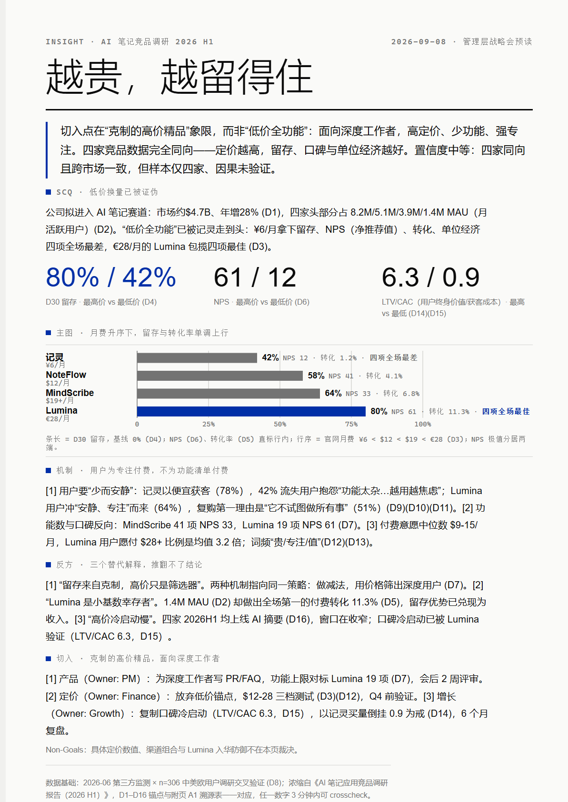

# one-pager

An agent skill for compressing anything — a book, a 60-page report, meeting notes, a proposal — into exactly one A4 page that argues like an Amazon memo and looks like a magazine's art desk made it. Packaged as a standard skill folder (`npx skills add`), readable by any coding agent with filesystem access. Deliberately **not** a PPT tool.

**English** · [中文文档](README.zh-CN.md)

## What This Does

It helps people who don't write for a living produce one-page documents that hold up — executive memos, book digests, research insights — without knowing narrative structure or typography. The approach is **show, don't tell**: instead of asking you to describe your aesthetic preferences in words, it recommends a look with a reason, or generates visual previews and lets you pick.

Here are four pages made through the skill — page one of each; every page carries an appendix of evidence behind it:

<table>
  <tr>
    <td width="50%" align="center" valign="top">
      <a href="examples/proposal-q3-budget-zh.html"></a>
      <br><sub><b>Decision memo</b> · zh — Q3 channel call for leadership · <a href="examples/proposal-q3-budget-zh.html">source</a></sub>
    </td>
    <td width="50%" align="center" valign="top">
      <a href="examples/proposal-pricing-en.html"></a>
      <br><sub><b>Executive brief</b> · en — pricing decision before a board meeting · <a href="examples/proposal-pricing-en.html">source</a></sub>
    </td>
  </tr>
  <tr>
    <td width="50%" align="center" valign="top">
      <a href="examples/book-memo-working-backwards.html"></a>
      <br><sub><b>Book memo</b> — *Working Backwards* distilled for a book club · <a href="examples/book-memo-working-backwards.html">source</a></sub>
    </td>
    <td width="50%" align="center" valign="top">
      <a href="examples/insight-competitive-research.html"></a>
      <br><sub><b>Insight page</b> — competitive research in 3 minutes · <a href="examples/insight-competitive-research.html">source</a></sub>
    </td>
  </tr>
</table>

Each one passed the skill's own 30-assertion verifier before shipping. The same checks run on every page it produces — yes, including the ones that were inconvenient (see Evaluated & Audited).

### Key Features

- **One page, hard constraint** — the body must fit one A4 page. When it overflows, words get cut; type never shrinks. Verified by script, not hope.
- **Two decision layers** — a narrative methodology (Amazon writing culture × MBB consulting) and a style system (48 hand-inspected samples), each with exactly one authoritative reference. Content and visuals never argue over jurisdiction.
- **Style discovery without vocabulary** — can't articulate what you want a page to *feel* like? That's normal. It recommends with a reason, asks one plain-language question, or shows three previews and lets your eyes vote.
- **Evidence you can crosscheck** — every number in the body carries a `(D#)` anchor resolving into an appendix traceability table. Any figure, under 3 minutes. (The anchors are the skill's own idea of fun.)
- **Book-scale tiering** — feed it a whole book (≥ 50k characters) and get three tiers: one-pager (30 seconds) + six-page narrative (10-minute silent read) + unlimited appendix. The middle tier borrows Amazon's 6-pager rules, including "written to be read without a presenter."
- **Text that survives a first read** — dash budgets, no screenshot-quotable lines, jargon glossed on first use. The polish pass assumes a smart reader who has never seen your source material.

## Installation

**Any agent with skills support** (Claude Code, Codex, Cursor, Windsurf, iClaw, Baymax):

```bash
npx skills add QinyuTan/one-page-doc-skills
```

**Manual**: copy the `one-pager/` directory into your agent's skills folder (e.g. `.claude/skills/` or `~/.agents/skills/`).

**Optional, for PDF export**: Python with `playwright`. Without it, the bundled `export.py` falls back to system Edge/Chrome — slower, but it works. For PDF input you'll want `pypdf` (the bundled `extract.py` uses it). Nothing else: no npm, no build tools.

## Usage

### Distill a book into one page

> "Distill my notes on *Principles* into one page for Friday's book club — focus on what the team can borrow"

1. The skill routes the scenario (reader will *retell* → Book Memo pattern) and says so before writing anything
2. Drafts the argument through a 9-gate QC — elevator test, So-What scan, weasel-word hunt — then polishes the text for AI tells and first-read clarity
3. Routes the visual (a data-leaning digest will likely get a Swiss Blueprint recommendation) and fills the page
4. Checks that the page fits, exports a self-contained HTML + PDF

### Turn research into a decision page

> "One page on the Q3 experiments for leadership — the call is to cut paid feed and move budget to referral"

Routes to the *decide* fork → Proposal five-part form: BLUF with a decision flag, observed factors, actions with named owners. Every claim quantified from your data, each number anchored `(D1)…(Dn)`.

### Compress a report nobody reads

> "This 60-page research report is dying in the group chat — one page people can grasp in 3 minutes"

Routes to the *be convinced* fork → Insight Page: a conclusion block with a confidence level (the skill will write "medium confidence, four competitors, causality unverified" rather than pretend), one chart one conclusion, counter-hypotheses answered, weasel words zero tolerance.

Even the complaint alone triggers it — *"too long, no highlights"* is a valid brief.

### A dozen more things it eats

The three recipes above are the shapes. Real briefs are messier — here are ones that actually work, with the exact first sentence to copy:

**When someone has to learn something**

| You say | You get |
|---|---|
| "Onboard note: compress our team wiki into one page for the new hire starting Monday" | A Book Memo of your norms — what survives is what actually matters |
| "This 20-page paper — one page, focus on the method and what I can borrow for my experiment design" | A paper digest you can retell at lab meeting without the PDF open |
| "Turn this week's course notes into a one-page cheat sheet I can pin above my desk" | Distilled notes, jargon glossed — pinned, not archived |

**When someone has to decide or act**

| You say | You get |
|---|---|
| "My three wins this week into a one-page status — my boss reads for 30 seconds" | A status page where the 30 seconds land on the right numbers |
| "I'm asking the VP for two contractor headcount — one page, data in the attachment" | A proposal with a decision flag, not a deck she'll forward with "thoughts?" |
| "Today's 40-minute review call transcript → one-page decision memo, who owns what, by when" | Meeting notes that became a decision instead of a file |
| "Project's done — the retro doc into one page" | A closing memo people will actually read before the next kickoff |

**When someone has to be convinced**

| You say | You get |
|---|---|
| "This week's 300 user complaints into one page — by pain, by frequency" | An insight page that names the top pain with counts, not adjectives |
| "The churn analysis I just ran — one page for the ops team, lead with the counterintuitive bit" | A conclusion with confidence level and counter-hypotheses, not charts to interpret |
| "Three competitors' public material into one comparison page" | One insight, one chart — not a feature-checklist wall |

**Feeding it differently**

| You say | You get |
|---|---|
| "This 45-slide board deck → one page with the three numbers and the ask" | Deck as *input* is accepted (deck as *output* is declined — that's the line) |
| "Compress this link" (paste any article URL) | It fetches, routes, and pages it — the link is the brief |
| "Convince my CEO to greenlight the messaging redesign — here's my draft thinking" | 0→1 mode: it builds the argument from your idea via Working Backwards, PR-first |
| "This whole book" (a 300-page PDF lands in the folder) | Batch mode, unprompted: one-pager + six-page narrative + evidence appendix |

### Ways to steer it

- **Name the reader and their next move.** "For leadership, who decides Friday" routes better than "make it good" — the fork is literally built on the reader's next action.
- **If you already know the call, say it.** "The conclusion is: cut paid feed" turns the skill into your advocate. Leave the conclusion out and it will still argue — it just won't pretend the data decided for you.
- **Override the style any time.** It declares its routing (fork + template + skin) before writing HTML — that's your window. "Actually, make it feel like a magazine feature" costs one sentence. Or name nothing and judge the three previews it offers.
- **Ask for the PNG when it's going in a group chat** — HTML for email and print, PNG for chat and slides, PDF for attachments.
- **Keep the appendix in mind when stakes are high.** The traceability table is the part that survives a skeptical CFO: every number, where it came from, how to recheck it.

### When not to use it

- You want slides as the deliverable → use a slide skill. This one will decline, politely and on purpose.
- You need the full document preserved (contracts, specs, audit records) → compression is the wrong operation; it summarizes up, it doesn't archive down.
- You want a living dashboard → it makes one page, once, that argues. Refreshing is a different job.

## Included Styles

Seven presets, grouped by the job they do. All six gallery pages below were built from the same decision data (a bookstore's late-hours call), so you can compare temperaments apples-to-apples. You never need to name one.

**For decisions & data**

- [**Swiss Blueprint**](examples/proposal-q3-budget-zh.png) — Klein blue `#002FA7` on warm paper, hairline rules, display type that gets thinner as it gets bigger. The modernist's year-end report.
- [**Archive Ledger**](examples/t3-ledger.html) — ivory and ink with one deep accent, ledger rows numbered like an archive. For white papers and investor briefs — anything that should outlive the quarter.

**For stories & people**

- [**Magazine Feature**](examples/t2-magazine.html) — serif display, drop caps, a pull quote, two justified columns. The Sunday long-read.
- [**Paper Craft**](examples/t5-paper.html) — handwritten annotations over a readable sans body, paper grain, washi tape. Three hand-drawn touches maximum — more than that and it stops being charming.

**For statements**

- [**Poster Manifesto**](examples/t4-poster.html) — one claim in ultra-black type across half the page, evidence takes the other half. Cream paper, fire red.
- [**Era Revival**](examples/t6-retro.html) — the whole page is a Win95 window: title bar, menu, status bar, checkboxes. Nostalgia with intent, not as a costume.
- [**Terminal Noir**](examples/t7-terminal.html) — the decision rendered as a shell session: prompt, flags, syntax highlighting, `exit 0`. Ships to engineers.

### Style gallery — same data, six temperaments

<p>
  <a href="examples/t2-magazine.png"></a>
  <a href="examples/t3-ledger.png"></a>
  <a href="examples/t4-poster.png"></a>
</p>
<p>
  <a href="examples/t5-paper.png"></a>
  <a href="examples/t6-retro.png"></a>
  <a href="examples/t7-terminal.png"></a>
</p>

One decision — keep the bookstore open until midnight on weekends — rendered six ways. Click any image for the full page; the HTML sources live in `examples/`.

## Architecture

**Progressive disclosure** — the main `SKILL.md` is a 99-line workflow map; supporting references load on-demand only when needed.

| File | Purpose | Loaded when |
|---|---|---|
| `SKILL.md` | 4-phase pipeline orchestration | Always |
| `references/narrative-methodology.md` | Amazon×MBB narrative rules, 3 forks, 9 QC gates | Phase 1 (argument) |
| `references/humanize.md` | De-AI-tell checklist + first-read rule | Phase 1 (after QC) |
| `references/batch-mode.md` | Book-scale tiering N0/N1/N2 | Phase 1 (input ≥ 50k chars) |
| `references/input-protocol.md` | Input preflight + verification toolbox | Phase 0 and Phase 3 |
| `references/style-system.md` | Visual routing, T1–T7 presets, R1–R10 veto rules | Phase 2 (composition) |
| `references/typography.md` | A4 mechanics, type floors, `.page` DOM contract | Phase 2 |
| `assets/template.html` | Swiss skeleton: `.page` / `.narrative` / `.appendix` | Phase 2 |
| `scripts/` | `export.py` · `extract.py` · `check.py` | Phases 0 and 3 |

## Philosophy

1. **The page is the argument.** A page that could overflow never had to decide what matters.
2. **Nine gates beat good intentions.** Writing improves when something sends you back.
3. **Evidence lives in the appendix.** Discipline lives on page one. Both survive the meeting.
4. **Generic is forgettable.** One accent per page, no gradients, no decoration that encodes nothing.
5. **A number without an anchor is a slogan.** Every figure points to somewhere you can check.

## Evaluated & Audited

Four scenarios ran with-skill vs baseline in fresh subagent sessions: fork routing 4/4, structure assertions passing, weasel-word-free, one-page constraint held through 2–3 rounds of word-cutting. Zero type-shrinking — R1 is a hard rule, and the verifier enforces it on the author too (it has sent this skill's own edits back to the oven three times now).

A 20-query trigger-routing simulation passed 20/20, including the deck boundary: deck-as-*input* (summarize this board deck) is accepted; deck-as-*output* (make a 20-slide PPT) is declined. That's the point.

Three rounds of independent adversarial audit: 7.5 → 7.4 → 8.1. The dip was real — the auditor caught shipped examples failing the skill's own newer rules. They were regenerated; all four now report `ALL RUN CHECKS PASS` via `scripts/check.py`. Honest limitation: the audits ran on one model family. Cross-model behavior is unverified — clone the repo, the test set ships with fixtures, and re-run everything yourself.

## Requirements

- Any agent that reads skill files (Claude Code, Codex, Cursor, Windsurf, iClaw, Baymax)
- For PDF export: Python 3, optionally `playwright` (auto-falls back to system Edge/Chrome)
- For PDF input: `pypdf`

## Credits

The narrative methodology and style system were authored by the project owner, distilled from Amazon's writing culture, MBB consulting practice, and 48 first-hand style samples. House patterns trace to Adler, Sivers, Zelazny, and FT data journalism — the source genealogy tables live in the references.

## License

MIT — use it, fork it, feed it a book.
