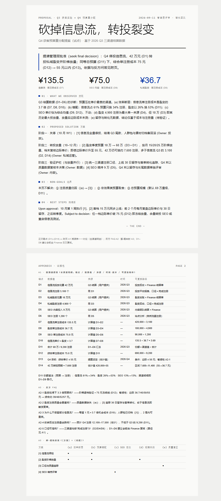
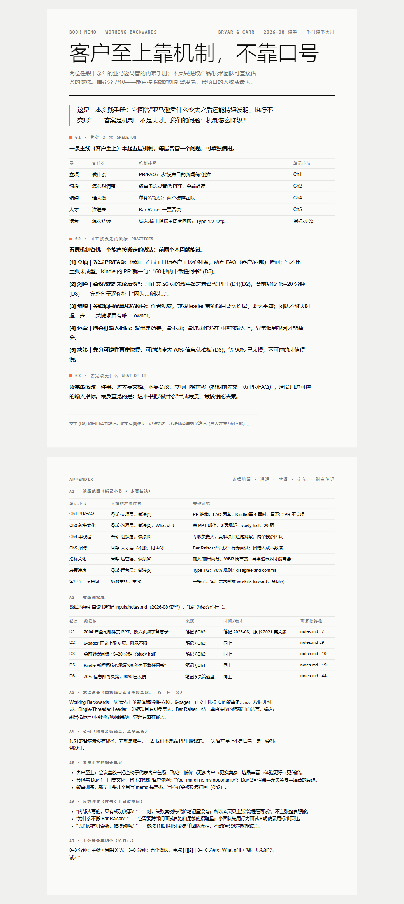
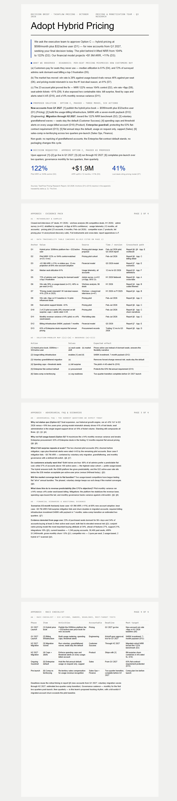
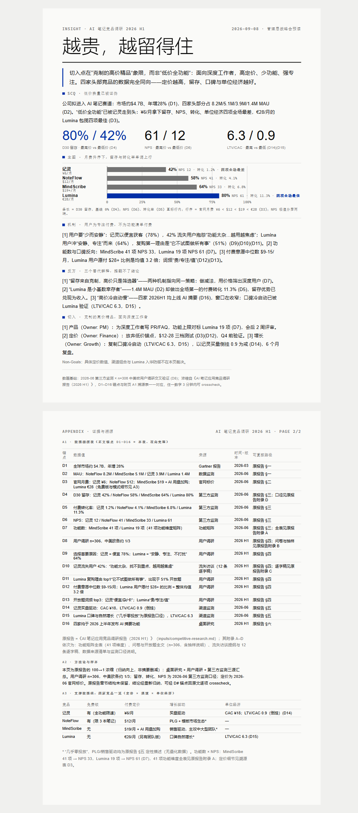
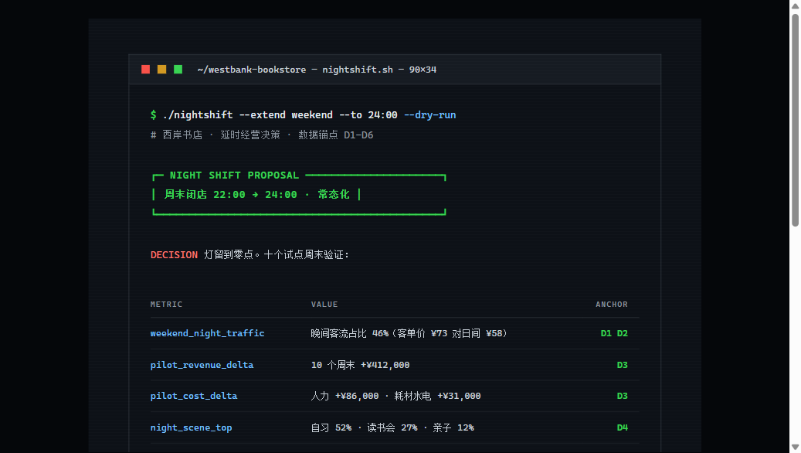

# one-pager

An agent skill for compressing anything — a book, a 60-page report, meeting notes, a proposal — into exactly one A4 page that argues like an Amazon memo and looks like it came from a magazine's art desk. Packaged as a standard skill folder (`npx skills add`), readable by any coding agent with filesystem access. Deliberately **not** a PPT tool.

**English** · [中文文档](README.zh-CN.md)

## What This Does

It helps non-writers produce one-page documents that hold up under scrutiny — executive memos, book digests, research insights — without knowing narrative structure or typography. The approach is **show, don't tell**: instead of asking you to describe your aesthetic preferences in words, it recommends a look with a reason, or generates visual previews and lets you pick what you like.

Here are four pages made through the skill:

<p>
  
  
  
  
</p>

Each one passed the skill's own 30-assertion verifier before shipping — the same checks run on every page it produces.

### Key Features

- **One Page, Hard Constraint** — the body must fit one A4 page. When it overflows, words get cut; type never shrinks. Verified by script, not hope.
- **Two Decision Layers** — an Amazon×MBB narrative methodology and a 48-sample style system, each with exactly one authoritative reference. Content and visuals never argue over jurisdiction.
- **Visual Style Discovery** — can't articulate design preferences? No problem. It recommends with a reason, asks one plain-language question, or shows three previews and lets your eyes vote.
- **Traceable Evidence** — every number in the body carries a `(D#)` anchor resolving into an appendix traceability table. Any figure crosschecks in under 3 minutes.
- **Book-Scale Tiering** — feed it a whole book (≥ 50k characters) and get a three-tier deliverable: one-pager (30 seconds) + six-page narrative (10-minute silent read) + unlimited appendix.
- **De-AI'd, First-Read-Safe Text** — dash budgets, no screenshot-quotable lines, rhythm variation, jargon glossed on first use. A first-time reader survives one linear pass.

## Installation

**Any agent with skills support** (Claude Code, Codex, Cursor, Windsurf, iClaw, Baymax):

```bash
npx skills add QinyuTan/one-page-doc-skills
```

**Manual**: copy the `one-pager/` directory into your agent's skills folder (e.g. `.claude/skills/` or `~/.agents/skills/`).

**Optional, for PDF export**: Python with `playwright` — otherwise the bundled `export.py` falls back to system Edge/Chrome automatically. For PDF input, `pypdf` (the bundled `extract.py` uses it). Nothing else. No npm, no build tools.

## Usage

### Distill a book into one page

> "Distill my notes on *Principles* into one page for Friday's book club — focus on what the team can borrow"

1. The skill routes the scenario (reader will *retell* → Book Memo pattern) and declares the routing before writing anything
2. Drafts the argument through a 9-gate QC (elevator test, So-What scan, weasel-word hunt…), then polishes the text for AI tells and first-read clarity
3. Routes the visual — likely recommending Swiss Blueprint for a data-leaning digest — and fills the A4 page
4. Verifies the page fits and exports a self-contained HTML + PDF

### Turn research into a decision page

> "One page on the Q3 experiments for leadership — the call is to cut paid feed and move budget to referral"

1. Routes to the *decide* fork → Proposal five-part form (BLUF with decision flag, observed factors, actions with owners)
2. Quantifies every claim from your data, anchors each number `(D1)…(Dn)`
3. Routes the visual, builds the page, exports

### Compress a report nobody reads

> "This 60-page research report is dying in the group chat — one page people can grasp in 3 minutes"

Routes to the *be convinced* fork → Insight Page: conclusion block with confidence level, one chart one conclusion, counter-hypotheses addressed, weasel words zero-tolerance.

## Included Styles

Seven presets, grouped by the job they do — shown below, all built from the same decision data (a bookstore's late-hours call), so you can compare temperaments apples-to-apples. Each is fully specified in the style system; you never need to name one.

**For decisions & data**

- [**Swiss Blueprint**](examples/proposal-q3-budget-zh.png) — Klein blue `#002FA7` on warm paper, hairline rules, display type that gets thinner as it gets bigger. The modernist's year-end report.
- [**Archive Ledger**](examples/t3-ledger.html) — ivory and ink with one deep accent, archival numbering on ledger tables. The institution's vault, for white papers and investor briefs.

**For stories & people**

- [**Magazine Feature**](examples/t2-magazine.html) — serif display over sans body, drop caps, pull quotes, two-column justified text. The Sunday long-read.
- [**Paper Craft**](examples/t5-paper.html) — handwritten annotations over a readable sans body, paper grain, washi tape; three hand-drawn touches maximum. The workshop table.

**For statements**

- [**Poster Manifesto**](examples/t4-poster.html) — one claim in ultra-black type across half the page, evidence takes the other half. Cream paper, fire red.
- [**Era Revival**](examples/t6-retro.html) — a full Win95 window as the page: title bar, menu, status bar, checkboxes. Nostalgia with intent.
- [**Terminal Noir**](examples/t7-terminal.html) — the decision rendered as a shell session: prompt, flags, syntax highlighting, exit 0. Ships to engineers.

### Style gallery — same data, six temperaments

<p>
  <a href="examples/t2-magazine.png"></a>
  <a href="examples/t3-ledger.png"></a>
  <a href="examples/t4-poster.png"></a>
</p>
<p>
  <a href="examples/t5-paper.png"></a>
  <a href="examples/t6-retro.png"></a>
  <a href="examples/t7-terminal.png"></a>
</p>
<sub>One decision — extend the bookstore's weekend hours to midnight — rendered in six of the seven presets. Click any image for the full page; the HTML sources live in `examples/`.</sub>

## Architecture

**Progressive disclosure** — the main `SKILL.md` is a 99-line workflow map; supporting references load on-demand only when needed.

| File | Purpose | Loaded when |
|---|---|---|
| `SKILL.md` | 4-phase pipeline orchestration | Always |
| `references/narrative-methodology.md` | Amazon×MBB narrative rules, 3 forks, 9 QC gates | Phase 1 (argument) |
| `references/humanize.md` | De-AI-tell checklist + first-read rule | Phase 1 (after QC) |
| `references/batch-mode.md` | Book-scale tiering N0/N1/N2 | Phase 1 (input ≥ 50k chars) |
| `references/input-protocol.md` | Input preflight + verification toolbox | Phase 0 and Phase 3 |
| `references/style-system.md` | Visual routing, T1–T7 presets, R1–R10 veto rules | Phase 2 (composition) |
| `references/typography.md` | A4 mechanics, type floors, `.page` DOM contract | Phase 2 |
| `assets/template.html` | Swiss skeleton: `.page` / `.narrative` / `.appendix` | Phase 2 |
| `scripts/` | `export.py` · `extract.py` · `check.py` | Phases 0 and 3 |

## Philosophy

1. **The constraint is the product.** A page that could overflow was never forced to decide what matters.
2. **You don't need to be a writer to argue well.** You need a gate that sends you back — there are nine.
3. **Evidence lives in the appendix. Discipline lives on page one.**
4. **Generic is forgettable.** One accent per page, no gradients, no decoration that encodes nothing.
5. **A claim you can't crosscheck is a slogan.** Every number carries an anchor.

## Evaluated & Audited

Four scenarios ran with-skill vs baseline in fresh subagent sessions: fork routing 4/4, structure assertions passing, weasel-word-free, one-page constraint held through 2–3 rounds of word-cutting — zero type-shrinking, ever. A 20-query trigger-routing simulation passed 20/20, including the deck boundary: deck-as-*input* (summarize this board deck) is accepted; deck-as-*output* (make a 20-slide PPT) is declined, by design.

The skill has been through three rounds of independent adversarial audit: 7.5 → 7.4 → 8.1. The dip was real — the auditor caught shipped examples failing the skill's own newer rules; they were regenerated and now report `ALL RUN CHECKS PASS` via `scripts/check.py`. The test set ships with input fixtures and a reproduction protocol; clone the repo and re-run everything yourself.

## Requirements

- Any agent that reads skill files (Claude Code, Codex, Cursor, Windsurf, iClaw, Baymax)
- For PDF export: Python 3, optionally `playwright` (auto-falls back to system Edge/Chrome)
- For PDF input: `pypdf`

## Credits

The narrative methodology and style system were authored by the project owner, distilled from Amazon's writing culture, MBB consulting practice, and 48 first-hand style samples. House patterns trace to Adler, Sivers, Zelazny, and FT data journalism — full source genealogy tables live in the references.

## License

MIT — use it, fork it, feed it a book.
